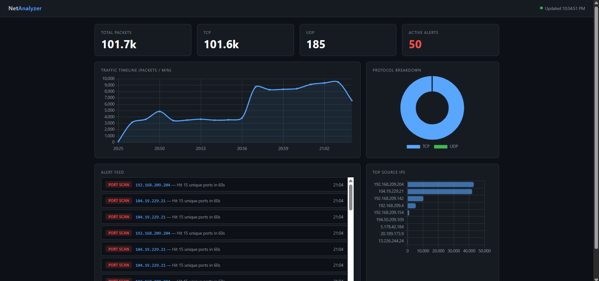

# 🛡️ NetAnalyzer

<p align="center">
  
</p>

<p align="center">
  <a href="https://www.python.org/downloads/"></a>
  <a href="https://scapy.net/"></a>
  <a href="https://flask.palletsprojects.com/"></a>
  <a href="LICENSE"></a>
  
</p>

<p align="center">
  A real-time network traffic analyzer built with Python. Captures live packets, detects anomalies like port scans and traffic spikes, and visualizes everything through a live web dashboard.
</p>

---

## 📋 Table of Contents

- [Features](#-features)
- [Architecture](#-architecture)
- [Getting Started](#-getting-started)
  - [Prerequisites](#prerequisites)
  - [Installation](#installation)
- [Usage](#-usage)
  - [Capture Traffic](#capture-traffic)
  - [Launch Dashboard](#launch-dashboard)
  - [View Alerts](#view-alerts)
- [Project Structure](#-project-structure)
- [Anomaly Detection](#-anomaly-detection)
- [Running Tests](#-running-tests)
- [Roadmap](#-roadmap)
- [Contributing](#-contributing)
- [License](#-license)

---

## ✨ Features

- 📡 **Live Packet Capture** — Sniffs TCP/UDP/IP traffic on any network interface using Scapy
- 🗄️ **Persistent Storage** — Logs every packet to a local SQLite database
- 🚨 **Anomaly Detection** — Automatically flags port scans and traffic spikes in real time
- 📊 **Live Dashboard** — Flask web app with auto-refreshing charts (protocol breakdown, traffic timeline, top IPs)
- ⚡ **Alert Feed** — Real-time alert log with type, source IP, and timestamp
- 🖥️ **CLI Interface** — Simple commands to control capture, dashboard, and alerts
- 🧪 **Unit Tested** — Core detection logic covered with `pytest`

---

## 🏗️ Architecture

```
┌─────────────────────────────────────────────────────────┐
│                        CLI (cli.py)                      │
└────────────┬──────────────────────────┬─────────────────┘
             │                          │
     ┌───────▼────────┐        ┌────────▼────────┐
     │ Packet Capture │        │    Dashboard     │
     │  (Scapy)       │        │    (Flask)       │
     └───────┬────────┘        └────────▲────────┘
             │                          │
     ┌───────▼────────┐                 │
     │    Analysis    │                 │
     │ Port Scan      │                 │
     │ Traffic Spike  │                 │
     └───────┬────────┘                 │
             │                          │
     ┌───────▼──────────────────────────┤
     │           SQLite Database        │
     │     packets table │ alerts table │
     └──────────────────────────────────┘
```

**Data flow:** Network Interface → Scapy Sniffer → Packet Parser → SQLite → Flask API → Browser Dashboard

---

## 🚀 Getting Started

### Prerequisites

| Requirement | Version | Notes |
|---|---|---|
| Python | 3.8+ | [Download](https://www.python.org/downloads/) |
| Npcap | Latest | Windows only — [Download](https://npcap.com/#download) |
| Git | Any | For cloning |

> **Linux/macOS:** Run capture commands with `sudo` for raw socket access.  
> **Windows:** Install Npcap before running. Run terminal as Administrator.

### Installation

**1. Clone the repository**

```bash
git clone https://github.com/amir9367/network-analyzer.git
cd network-analyzer
```

**2. Create and activate a virtual environment**

```bash
# Linux / macOS
python3 -m venv venv
source venv/bin/activate

# Windows
python -m venv venv
venv\Scripts\activate
```

**3. Install dependencies**

```bash
pip install -r requirements.txt
```

**4. Verify Scapy can see your interfaces**

```bash
python -c "from scapy.all import get_if_list; print(get_if_list())"
```

---

## 💻 Usage

### Capture Traffic

Auto-detects your active network interface:

```bash
# Linux / macOS
sudo python cli.py capture

# Windows (run terminal as Administrator)
python cli.py capture
```

Capture on a specific interface:

```bash
python cli.py capture --interface eth0
```

Capture a fixed number of packets then stop:

```bash
python cli.py capture --interface eth0 --count 100
```

### Launch Dashboard

```bash
python cli.py dashboard
```

Open your browser at **http://localhost:5000**

The dashboard auto-refreshes every 5 seconds. Run capture in one terminal and the dashboard in another to see live data.

### View Alerts

Print recent anomaly alerts to the terminal:

```bash
python cli.py alerts
```

Example output:

```
[2024-01-15T14:23:01] PORT_SCAN    | 192.168.1.45 — Hit 17 unique ports in 60s
[2024-01-15T14:25:44] TRAFFIC_SPIKE | 10.0.0.3    — Sent 6,291,456 bytes in 60s
```

---

## 📁 Project Structure

```
network-analyzer/
├── capture/
│   ├── __init__.py
│   └── sniffer.py          # Packet capture and parsing (Scapy)
├── analysis/
│   ├── __init__.py
│   ├── parser.py           # Packet field extraction
│   └── detector.py         # Anomaly detection logic
├── storage/
│   ├── __init__.py
│   └── database.py         # SQLite schema, queries, inserts
├── dashboard/
│   ├── app.py              # Flask routes and REST API
│   ├── templates/
│   │   └── index.html      # Dashboard HTML
│   └── static/
│       └── charts.js       # Chart.js rendering + auto-refresh
├── tests/
│   └── test_detector.py    # Unit tests for anomaly detection
├── cli.py                  # Entry point — CLI commands
├── requirements.txt
└── README.md
```

---

## 🚨 Anomaly Detection

NetAnalyzer monitors traffic in rolling 60-second windows and fires alerts when thresholds are crossed.

| Alert Type | Trigger | Default Threshold |
|---|---|---|
| `PORT_SCAN` | Single source IP hits too many unique destination ports | 15 unique ports / 60s |
| `TRAFFIC_SPIKE` | Single source IP sends excessive data | 5 MB / 60s |

Thresholds are configurable at the top of `analysis/detector.py`:

```python
PORT_SCAN_THRESHOLD = 15        # unique ports before alert fires
TRAFFIC_SPIKE_BYTES = 5_000_000 # bytes before alert fires
WINDOW_SECONDS      = 60        # rolling window size
```

---

## 🧪 Running Tests

```bash
pip install pytest
pytest tests/ -v
```

Expected output:

```
tests/test_detector.py::test_port_scan_triggers_alert       PASSED
tests/test_detector.py::test_no_false_positive_for_normal_traffic  PASSED
```

---

## 🗺️ Roadmap

- [x] Live packet capture
- [x] SQLite storage
- [x] Port scan detection
- [x] Traffic spike detection
- [x] Flask dashboard with live charts
- [x] CLI interface
- [x] Unit tests
- [ ] GeoIP lookup — map traffic origins to countries
- [ ] Email/webhook alerts
- [ ] PCAP export (Wireshark-compatible)
- [ ] Docker support
- [ ] Packets-per-second rate limiting detection

---

## 🤝 Contributing

Contributions are welcome! Here's how:

1. Fork the repository
2. Create a feature branch: `git checkout -b feature/your-feature-name`
3. Commit your changes: `git commit -m "Add: your feature description"`
4. Push the branch: `git push origin feature/your-feature-name`
5. Open a Pull Request

Please make sure existing tests pass before submitting. Adding tests for new features is appreciated.

---

## ⚖️ License

Distributed under the MIT License. See [LICENSE](LICENSE) for details.

---

## ⚠️ Disclaimer

This tool is intended for use on networks you own or have explicit permission to monitor. Unauthorized packet capture may violate laws and regulations in your jurisdiction. Use responsibly.

---

<p align="center">Built with Python & Scapy</p>
